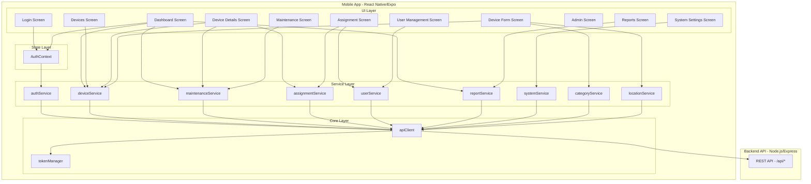
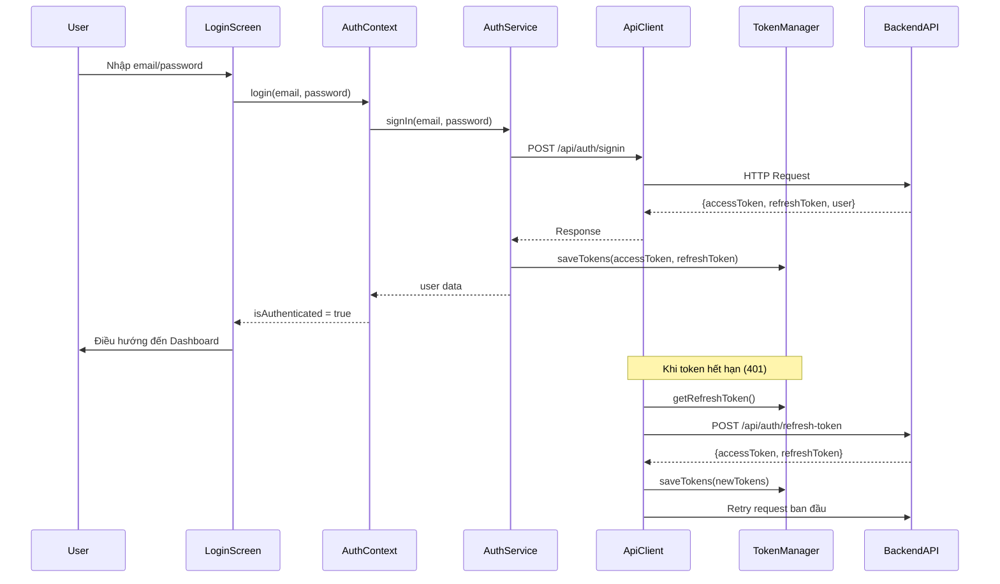

# Tài liệu Thiết kế - Tích hợp API Backend vào Mobile App

## Tổng quan

Tài liệu này mô tả thiết kế kỹ thuật để tích hợp toàn bộ API backend (Node.js/Express/MongoDB) vào ứng dụng mobile React Native/Expo. Hiện tại, tất cả các màn hình đều sử dụng dữ liệu hardcoded (mock data). Thiết kế này sẽ tạo ra một lớp service hoàn chỉnh để kết nối với backend thực, bao gồm: API client tập trung, quản lý xác thực (JWT), service layer cho từng domain, state management qua React Context, và xử lý lỗi thống nhất.

### Quyết định thiết kế chính

1. **Sử dụng `fetch` thay vì axios**: Giảm dependency, `fetch` đã có sẵn trong React Native. Wrapper tùy chỉnh cung cấp đủ tính năng cần thiết.
2. **SecureStore cho token**: Sử dụng `expo-secure-store` để lưu JWT token an toàn trên thiết bị.
3. **React Context cho auth state**: Đơn giản, phù hợp với quy mô app, không cần thêm state management library phức tạp.
4. **Service layer pattern**: Mỗi domain (device, maintenance, assignment, user, report, system) có một service module riêng, tất cả đều sử dụng chung API client.
5. **Custom hooks cho data fetching**: Mỗi màn hình sử dụng custom hook để quản lý loading/error/data state.

## Kiến trúc

### Sơ đồ kiến trúc tổng thể



### Luồng xác thực (Auth Flow)



## Thành phần và Giao diện

### 1. Token Manager (`services/tokenManager.ts`)

Quản lý lưu trữ và truy xuất JWT tokens sử dụng `expo-secure-store`.

```typescript
interface TokenManager {
  getAccessToken(): Promise<string | null>;
  getRefreshToken(): Promise<string | null>;
  saveTokens(accessToken: string, refreshToken: string): Promise<void>;
  clearTokens(): Promise<void>;
  hasTokens(): Promise<boolean>;
}
```

### 2. API Client (`services/apiClient.ts`)

HTTP client tập trung, tự động đính kèm token và xử lý refresh token.

```typescript
interface ApiClientConfig {
  baseURL: string;
  timeout?: number;
}

interface ApiResponse<T> {
  data: T;
  status: number;
}

interface ApiError {
  message: string;
  status: number;
  errors?: string[];
  code?: string;
}

interface ApiClient {
  get<T>(
    path: string,
    params?: Record<string, string>,
  ): Promise<ApiResponse<T>>;
  post<T>(path: string, body?: unknown): Promise<ApiResponse<T>>;
  put<T>(path: string, body?: unknown): Promise<ApiResponse<T>>;
  patch<T>(path: string, body?: unknown): Promise<ApiResponse<T>>;
  delete<T>(path: string): Promise<ApiResponse<T>>;
  setOnUnauthorized(callback: () => void): void;
}
```

Hành vi quan trọng:

- Tự động thêm `Authorization: Bearer <token>` vào mọi request (trừ auth endpoints)
- Khi nhận 401, tự động gọi `/api/auth/refresh-token` và retry request
- Nếu refresh thất bại, gọi `onUnauthorized` callback để logout
- Sử dụng mutex/flag để tránh nhiều refresh request đồng thời

### 3. Auth Context (`contexts/AuthContext.tsx`)

React Context cung cấp trạng thái xác thực cho toàn bộ app.

```typescript
interface AuthUser {
  id: string;
  email: string;
  firstName: string;
  lastName: string;
  role: "admin" | "inventory_manager" | "staff";
}

interface AuthContextType {
  user: AuthUser | null;
  isAuthenticated: boolean;
  isLoading: boolean;
  login(email: string, password: string): Promise<void>;
  logout(): Promise<void>;
  checkAuth(): Promise<void>;
}
```

### 4. Auth Service (`services/authService.ts`)

```typescript
interface AuthService {
  signIn(
    email: string,
    password: string,
  ): Promise<{ user: AuthUser; accessToken: string; refreshToken: string }>;
  signOut(): Promise<void>;
  getProfile(): Promise<AuthUser>;
  register(data: RegisterData): Promise<{ user: AuthUser }>;
}
```

### 5. Device Service (`services/deviceService.ts`)

```typescript
interface DeviceService {
  getAll(params?: {
    page?: number;
    limit?: number;
  }): Promise<PaginatedResponse<Device>>;
  getById(id: string): Promise<Device>;
  search(query: string): Promise<Device[]>;
  filter(status: DeviceStatus): Promise<Device[]>;
  create(data: CreateDeviceData): Promise<Device>;
  update(id: string, data: UpdateDeviceData): Promise<Device>;
  delete(id: string): Promise<void>;
}
```

### 6. Maintenance Service (`services/maintenanceService.ts`)

```typescript
interface MaintenanceService {
  getAll(): Promise<MaintenanceRecord[]>;
  getUpcoming(): Promise<MaintenanceRecord[]>;
  getHistory(deviceId: string): Promise<MaintenanceRecord[]>;
  requestMaintenance(data: MaintenanceRequestData): Promise<MaintenanceRecord>;
}
```

### 7. Assignment Service (`services/assignmentService.ts`)

```typescript
interface AssignmentService {
  assign(data: {
    deviceId: string;
    userId: string;
    notes?: string;
  }): Promise<Assignment>;
  getHistory(deviceId: string): Promise<Assignment[]>;
}
```

### 8. User Service (`services/userService.ts`)

```typescript
interface UserService {
  getAll(): Promise<User[]>;
  getById(id: string): Promise<User>;
}
```

### 9. Report Service (`services/reportService.ts`)

```typescript
interface ReportService {
  getDeviceStatus(): Promise<DeviceStatusReport>;
  getAssignments(): Promise<AssignmentReport>;
  getWarranty(): Promise<WarrantyReport>;
  getWarrantyAlerts(): Promise<WarrantyAlert[]>;
  getDepreciation(): Promise<DepreciationReport>;
}
```

### 10. Category Service (`services/categoryService.ts`)

```typescript
interface CategoryService {
  getAll(): Promise<DeviceCategory[]>;
}
```

### 11. Location Service (`services/locationService.ts`)

```typescript
interface LocationService {
  getAll(): Promise<Location[]>;
}
```

### 12. System Service (`services/systemService.ts`)

```typescript
interface SystemService {
  getSettings(): Promise<SystemSettings>;
  updateSetting(key: string, value: unknown): Promise<void>;
}
```

## Mô hình Dữ liệu

### TypeScript Types (tương ứng với backend models)

```typescript
// types/api.ts

type DeviceStatus = "available" | "assigned" | "in_maintenance" | "retired";
type DeviceCondition = "new" | "good" | "fair" | "poor";
type UserRole = "admin" | "inventory_manager" | "staff";
type UserStatus = "active" | "inactive";
type MaintenanceType = "preventive" | "corrective" | "other";
type MaintenanceStatus =
  | "scheduled"
  | "in_progress"
  | "completed"
  | "cancelled";
type AssignmentStatus = "pending" | "acknowledged" | "active" | "returned";

interface Device {
  _id: string;
  assetTag: string;
  serialNumber: string;
  name: string;
  categoryId: DeviceCategory | string;
  manufacturer: string;
  model: string;
  specifications: Record<string, unknown>;
  purchaseDate: string;
  purchasePrice: number;
  currentValue: number;
  salvageValue: number;
  locationId: Location | string;
  status: DeviceStatus;
  condition: DeviceCondition;
  barcode: string;
  imageUrl: string;
  createdAt: string;
  updatedAt: string;
}

interface User {
  _id: string;
  email: string;
  firstName: string;
  lastName: string;
  role: UserRole;
  departmentId?: { _id: string; name: string };
  status: UserStatus;
  lastLogin: string;
  createdAt: string;
}

interface MaintenanceRecord {
  _id: string;
  deviceId: Device | string;
  type: MaintenanceType;
  status: MaintenanceStatus;
  scheduledDate: string;
  completedDate: string;
  performedBy: User | string;
  requestedBy: User | string;
  description: string;
  cost: number;
  notes: string;
  createdAt: string;
}

interface Assignment {
  _id: string;
  deviceId: Device | string;
  assignedTo: {
    userId: User | string;
    departmentId?: string;
  };
  assignedBy: User | string;
  assignmentDate: string;
  returnDate: string;
  status: AssignmentStatus;
  acknowledgedAt: string;
  notes: string;
  createdAt: string;
}

interface DeviceCategory {
  _id: string;
  name: string;
  description: string;
}

interface Location {
  _id: string;
  name: string;
  building: string;
  floor: string;
  room: string;
}

interface PaginatedResponse<T> {
  data: T[];
  total: number;
  page: number;
  limit: number;
  totalPages: number;
}

// API Error response format (từ backend errorHandler)
interface ApiErrorResponse {
  message: string;
  errors?: string[];
  field?: string;
  code?: string;
}

// Auth response
interface SignInResponse {
  accessToken: string;
  refreshToken: string;
  user: {
    id: string;
    email: string;
    firstName: string;
    lastName: string;
    role: UserRole;
  };
}

// Report types
interface DeviceStatusReport {
  totalDevices: number;
  byStatus: Record<DeviceStatus, number>;
  byCategory: Array<{ category: string; count: number }>;
}

interface WarrantyAlert {
  device: Device;
  daysRemaining: number;
  expiryDate: string;
}
```

### Cấu trúc thư mục mới

```
electronic-device-inventory-management/
├── services/
│   ├── apiClient.ts          # HTTP client tập trung
│   ├── tokenManager.ts       # Quản lý JWT tokens
│   ├── authService.ts        # Xác thực
│   ├── deviceService.ts      # Thiết bị CRUD
│   ├── maintenanceService.ts # Bảo trì
│   ├── assignmentService.ts  # Gán thiết bị
│   ├── userService.ts        # Quản lý người dùng
│   ├── reportService.ts      # Báo cáo
│   ├── categoryService.ts    # Danh mục thiết bị
│   ├── locationService.ts    # Vị trí
│   └── systemService.ts      # Cài đặt hệ thống
├── contexts/
│   └── AuthContext.tsx        # Auth state provider
├── types/
│   └── api.ts                # TypeScript type definitions
├── config/
│   └── api.ts                # API base URL config
└── hooks/
    └── useApiData.ts         # Generic data fetching hook
```

### Mapping API Endpoints

| Backend Route                        | HTTP Method | Mobile Service                        | Mô tả                |
| ------------------------------------ | ----------- | ------------------------------------- | -------------------- |
| `/api/auth/signin`                   | POST        | authService.signIn                    | Đăng nhập            |
| `/api/auth/signout`                  | POST        | authService.signOut                   | Đăng xuất            |
| `/api/auth/me`                       | GET         | authService.getProfile                | Lấy profile          |
| `/api/auth/refresh-token`            | POST        | apiClient (tự động)                   | Refresh token        |
| `/api/auth/register`                 | POST        | authService.register                  | Đăng ký user (admin) |
| `/api/devices`                       | GET         | deviceService.getAll                  | Danh sách thiết bị   |
| `/api/devices/:id`                   | GET         | deviceService.getById                 | Chi tiết thiết bị    |
| `/api/devices/search`                | GET         | deviceService.search                  | Tìm kiếm             |
| `/api/devices/filter`                | GET         | deviceService.filter                  | Lọc theo trạng thái  |
| `/api/devices`                       | POST        | deviceService.create                  | Thêm thiết bị        |
| `/api/devices/:id`                   | PUT         | deviceService.update                  | Sửa thiết bị         |
| `/api/devices/:id`                   | DELETE      | deviceService.delete                  | Xóa thiết bị         |
| `/api/maintenance`                   | GET         | maintenanceService.getAll             | Danh sách bảo trì    |
| `/api/maintenance/upcoming`          | GET         | maintenanceService.getUpcoming        | Bảo trì sắp tới      |
| `/api/maintenance/history/:deviceId` | GET         | maintenanceService.getHistory         | Lịch sử bảo trì      |
| `/api/maintenance/request`           | POST        | maintenanceService.requestMaintenance | Yêu cầu bảo trì      |
| `/api/assignments`                   | POST        | assignmentService.assign              | Gán thiết bị         |
| `/api/assignments/history/:deviceId` | GET         | assignmentService.getHistory          | Lịch sử gán          |
| `/api/users`                         | GET         | userService.getAll                    | Danh sách users      |
| `/api/reports/device-status`         | GET         | reportService.getDeviceStatus         | Báo cáo trạng thái   |
| `/api/reports/assignments`           | GET         | reportService.getAssignments          | Báo cáo gán          |
| `/api/reports/warranty`              | GET         | reportService.getWarranty             | Báo cáo bảo hành     |
| `/api/reports/warranty-alerts`       | GET         | reportService.getWarrantyAlerts       | Cảnh báo bảo hành    |
| `/api/reports/depreciation`          | GET         | reportService.getDepreciation         | Báo cáo khấu hao     |
| `/api/categories`                    | GET         | categoryService.getAll                | Danh mục thiết bị    |
| `/api/locations`                     | GET         | locationService.getAll                | Danh sách vị trí     |
| `/api/system/settings`               | GET         | systemService.getSettings             | Cài đặt hệ thống     |
| `/api/system/settings`               | POST        | systemService.updateSetting           | Cập nhật cài đặt     |

## Correctness Properties

_Một property (thuộc tính đúng đắn) là một đặc điểm hoặc hành vi phải luôn đúng trong mọi lần thực thi hợp lệ của hệ thống — về cơ bản là một phát biểu hình thức về những gì hệ thống phải làm. Properties đóng vai trò cầu nối giữa đặc tả dễ đọc cho con người và đảm bảo tính đúng đắn có thể kiểm chứng bằng máy._

### Property 1: URL construction

_For any_ base URL và bất kỳ request path nào, API client phải tạo ra URL đầy đủ bằng cách nối base URL với path, và URL kết quả phải luôn bắt đầu bằng base URL đã cấu hình.

**Validates: Requirements 1.1**

### Property 2: Token attachment to authenticated requests

_For any_ request được gửi qua API client khi access token tồn tại trong storage, header `Authorization` của request phải có giá trị `Bearer <token>` với token chính xác từ storage.

**Validates: Requirements 1.2**

### Property 3: Auto-refresh and cleanup on token expiry

_For any_ API request nhận response 401, API client phải thử refresh token. Nếu refresh thành công, request ban đầu phải được retry với token mới. Nếu refresh thất bại, tất cả tokens trong storage phải bị xóa và callback onUnauthorized phải được gọi.

**Validates: Requirements 1.3, 1.4**

### Property 4: Token storage round-trip

_For any_ cặp (accessToken, refreshToken) hợp lệ, sau khi gọi saveTokens thì getAccessToken và getRefreshToken phải trả về đúng giá trị đã lưu. Sau khi gọi clearTokens, cả hai phải trả về null.

**Validates: Requirements 2.2, 2.6**

### Property 5: Auth state consistency after login

_For any_ response thành công từ signIn chứa user data, AuthContext phải cập nhật user với đúng id, email, firstName, lastName, và role từ response, và isAuthenticated phải là true.

**Validates: Requirements 2.3**

### Property 6: Device service query parameter construction

_For any_ tham số tìm kiếm (search query string), bộ lọc trạng thái (DeviceStatus), hoặc tham số phân trang (page, limit), device service phải tạo request đến đúng endpoint (`/search`, `/filter`, hoặc `/`) với đúng query parameters tương ứng.

**Validates: Requirements 4.1, 4.2, 4.3**

### Property 7: Error response classification

_For any_ API error response, hàm xử lý lỗi phải phân loại chính xác: network error (không có response) → thông báo mất kết nối, status 5xx → thông báo lỗi server chung, status 4xx với message body → trả về message cụ thể từ response, status 4xx với mảng errors → trả về danh sách lỗi validation.

**Validates: Requirements 4.7, 11.1, 11.2, 11.3**

### Property 8: Role-based UI visibility

_For any_ user role, hàm xác định quyền phải trả về: role "staff" → không có quyền admin, không có quyền CRUD thiết bị; role "admin" hoặc "inventory_manager" → có đầy đủ quyền admin và CRUD. Và _for any_ route yêu cầu quyền admin, user không có quyền phải bị chuyển hướng.

**Validates: Requirements 9.4, 10.4, 12.1, 12.2, 12.3**

### Property 9: Client-side employee filter by name or department

_For any_ chuỗi tìm kiếm và danh sách users, kết quả lọc phải chỉ chứa những user có firstName, lastName, hoặc department name chứa chuỗi tìm kiếm (case-insensitive). Nếu chuỗi tìm kiếm rỗng, trả về toàn bộ danh sách.

**Validates: Requirements 6.5**

### Property 10: Client-side user filter by role

_For any_ role filter và danh sách users, nếu filter là "All" thì trả về toàn bộ danh sách, ngược lại kết quả phải chỉ chứa users có role khớp với filter đã chọn.

**Validates: Requirements 9.5**

### Property 11: Maintenance record count by status

_For any_ danh sách maintenance records, hàm đếm theo status phải trả về số lượng chính xác cho mỗi status (pending, completed, scheduled), và tổng các count phải bằng tổng số records trong danh sách.

**Validates: Requirements 7.2**

### Property 12: User display data completeness

_For any_ user object từ API, hàm format/render phải bao gồm đầy đủ: tên (firstName + lastName), email, role, và status trong output.

**Validates: Requirements 9.2**

## Xử lý Lỗi

### Phân loại lỗi

API client sẽ phân loại lỗi thành các nhóm sau:

| Loại lỗi               | Điều kiện                               | Hành vi                                          |
| ---------------------- | --------------------------------------- | ------------------------------------------------ |
| Network Error          | `fetch` throw error (không có response) | Hiển thị "Không có kết nối mạng" + nút "Thử lại" |
| Auth Error (401)       | Response status 401                     | Tự động refresh token, nếu thất bại → logout     |
| Forbidden (403)        | Response status 403                     | Hiển thị "Không đủ quyền truy cập"               |
| Validation Error (400) | Response status 400 với `errors` array  | Hiển thị lỗi cụ thể bên cạnh trường nhập liệu    |
| Not Found (404)        | Response status 404                     | Hiển thị "Không tìm thấy dữ liệu"                |
| Server Error (5xx)     | Response status 500-599                 | Hiển thị "Lỗi hệ thống, vui lòng thử lại sau"    |

### Error Response Parsing

Backend trả về lỗi theo các format:

```typescript
// Validation error
{ message: "Validation Error", errors: ["Name is required", "Email is invalid"] }

// Auth error
{ message: "Invalid credentials" }
{ message: "Account is locked. Contact administrator." }
{ message: "Token expired", code: "TOKEN_EXPIRED" }

// Generic error
{ message: "Internal Server Error" }
```

API client sẽ parse response và tạo `ApiError` object thống nhất cho tất cả services sử dụng.

### Retry Strategy

- Chỉ retry tự động cho lỗi 401 (token expired) — tối đa 1 lần retry sau khi refresh token
- Không retry tự động cho các lỗi khác
- Cung cấp nút "Thử lại" trên UI cho network errors và server errors để user tự retry

### Concurrent Refresh Protection

Sử dụng một biến flag (`isRefreshing`) và một queue (`failedQueue`) để đảm bảo:

- Chỉ có 1 refresh request tại một thời điểm
- Các request khác bị 401 trong khi đang refresh sẽ được queue lại
- Sau khi refresh thành công, tất cả queued requests được retry với token mới
- Sau khi refresh thất bại, tất cả queued requests bị reject

## Chiến lược Testing

### Thư viện và công cụ

- **Unit testing**: Jest (đã có sẵn qua Expo)
- **Property-based testing**: `fast-check` — thư viện PBT phổ biến nhất cho JavaScript/TypeScript
- **Mocking**: Jest built-in mocks cho fetch và SecureStore

### Cấu hình

- Mỗi property test chạy tối thiểu **100 iterations**
- Mỗi property test phải có comment tham chiếu đến property trong design document
- Format tag: **Feature: api-integration-mobile, Property {number}: {property_text}**
- Mỗi correctness property phải được implement bởi **MỘT** property-based test duy nhất

### Phân chia test

#### Property-based tests (sử dụng fast-check)

Kiểm tra các thuộc tính phổ quát trên nhiều input ngẫu nhiên:

1. **apiClient.test.ts**: Property 1 (URL construction), Property 2 (token attachment), Property 3 (auto-refresh)
2. **tokenManager.test.ts**: Property 4 (token round-trip)
3. **authContext.test.ts**: Property 5 (auth state consistency)
4. **deviceService.test.ts**: Property 6 (query parameter construction)
5. **errorHandler.test.ts**: Property 7 (error classification)
6. **permissions.test.ts**: Property 8 (role-based visibility)
7. **filters.test.ts**: Property 9 (employee filter), Property 10 (user role filter)
8. **maintenanceUtils.test.ts**: Property 11 (maintenance count by status)
9. **userUtils.test.ts**: Property 12 (user display completeness)

#### Unit tests (sử dụng Jest)

Kiểm tra các ví dụ cụ thể, edge cases, và integration points:

- Login flow với credentials hợp lệ/không hợp lệ
- Tài khoản bị khóa (edge case từ 2.5)
- App startup với token hợp lệ/không hợp lệ (2.7, 2.8)
- Các API endpoint integration: Dashboard data fetching (3.1-3.3), Device details (5.1-5.3), Report endpoints (8.1-8.4)
- Assignment flow thành công và thất bại (6.2, 6.4)
- Maintenance request thành công và thất bại (7.4, 7.6)
- System settings CRUD (10.1, 10.2)

### Cách tiếp cận bổ sung

- **Unit tests** tập trung vào ví dụ cụ thể và edge cases — không viết quá nhiều unit test vì property tests đã cover nhiều input
- **Property tests** tập trung vào thuộc tính phổ quát trên tất cả input
- Kết hợp cả hai để đảm bảo coverage toàn diện: unit tests bắt lỗi cụ thể, property tests xác minh tính đúng đắn tổng quát
