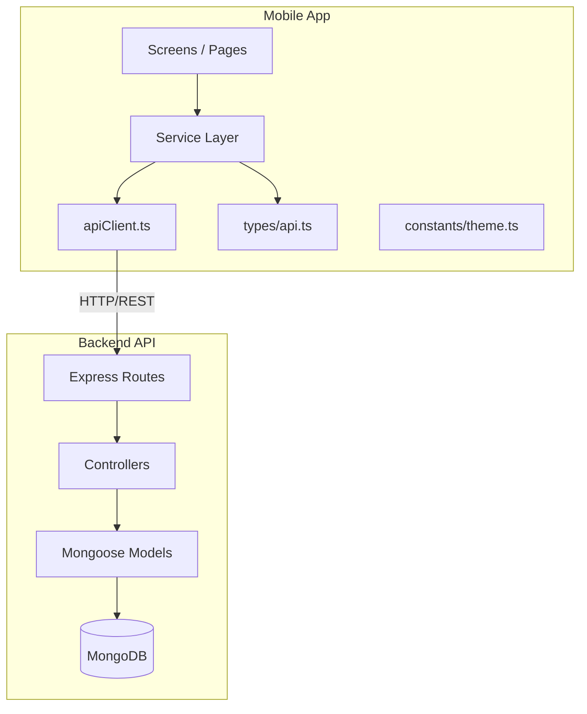

# Tài liệu Thiết kế — Tích hợp Toàn bộ API Backend vào Mobile App

## Tổng quan

Tài liệu này mô tả thiết kế kỹ thuật để tích hợp toàn bộ 13 nhóm API endpoint còn thiếu vào ứng dụng React Native/Expo, xây dựng 8 màn hình mới, và cập nhật theme màu xanh sáng hơn.

Ứng dụng mobile hiện tại (`electronic-device-inventory-management/`) sử dụng Expo Router (file-based routing), TypeScript, và một `apiClient` tập trung với cơ chế refresh token tự động. Backend (`Electronic-Device-Inventory-Management/src/`) là Node.js/Express với MongoDB, cung cấp 13 nhóm route: auth, devices, assignments, maintenance, categories, locations, users, reports, system, warranties, depreciation, departments, audit-logs.

Hiện tại mobile app chỉ tích hợp một phần các service (deviceService, assignmentService, maintenanceService, authService, categoryService, locationService, userService, reportService, systemService) với số lượng method hạn chế. Thiết kế này bổ sung tất cả method còn thiếu và tạo 4 service mới (warrantyService, depreciationService, departmentService, auditLogService).

## Kiến trúc

### Kiến trúc tổng thể



### Nguyên tắc thiết kế

1. **Service Pattern nhất quán**: Mỗi service là một object literal export với các async method, sử dụng `apiClient` để gọi API. Pattern này đã được thiết lập trong codebase hiện tại.
2. **Type-safe**: Tất cả request/response đều có TypeScript interface trong `types/api.ts`.
3. **File-based routing**: Expo Router sử dụng file system để định nghĩa route. Mỗi màn hình mới là một file `.tsx` trong `app/`.
4. **Tái sử dụng component**: Các component UI chung (GradientHeader, SearchBar, StatCard, StatusBadge) đã có sẵn.

## Thành phần và Giao diện

### 1. Service Layer mới

#### warrantyService.ts (MỚI)

```typescript
interface WarrantyService {
  getAll(params?: {
    page?: number;
    limit?: number;
  }): Promise<PaginatedResponse<Warranty>>;
  getById(id: string): Promise<Warranty>;
  create(data: CreateWarrantyData): Promise<Warranty>;
  update(id: string, data: UpdateWarrantyData): Promise<Warranty>;
  delete(id: string): Promise<void>;
  getExpiring(days?: number): Promise<Warranty[]>;
  // Warranty Claims
  createClaim(data: CreateWarrantyClaimData): Promise<WarrantyClaim>;
  getAllClaims(params?: {
    page?: number;
    limit?: number;
  }): Promise<PaginatedResponse<WarrantyClaim>>;
  getClaimById(id: string): Promise<WarrantyClaim>;
  updateClaim(
    id: string,
    data: UpdateWarrantyClaimData,
  ): Promise<WarrantyClaim>;
  deleteClaim(id: string): Promise<void>;
}
```

#### depreciationService.ts (MỚI)

```typescript
interface DepreciationService {
  getAll(): Promise<DepreciationRule[]>;
  getRuleById(id: string): Promise<DepreciationRule>;
  getRuleByCategory(categoryId: string): Promise<DepreciationRule>;
  create(data: CreateDepreciationRuleData): Promise<DepreciationRule>;
  update(
    id: string,
    data: UpdateDepreciationRuleData,
  ): Promise<DepreciationRule>;
  delete(id: string): Promise<void>;
  calculateDeviceDepreciation(deviceId: string): Promise<DeviceDepreciation>;
  getCategoryDepreciation(categoryId: string): Promise<CategoryDepreciation>;
  batchUpdateValues(): Promise<BatchUpdateResult>;
}
```

#### departmentService.ts (MỚI)

```typescript
interface DepartmentService {
  getAll(): Promise<Department[]>;
  getById(id: string): Promise<Department>;
  create(data: CreateDepartmentData): Promise<Department>;
  update(id: string, data: UpdateDepartmentData): Promise<Department>;
  delete(id: string): Promise<void>;
}
```

#### auditLogService.ts (MỚI)

```typescript
interface AuditLogService {
  getAll(params?: AuditLogFilterParams): Promise<PaginatedResponse<AuditLog>>;
  exportCsv(params?: AuditLogFilterParams): Promise<string>;
}
```

### 2. Bổ sung method vào Service hiện có

#### deviceService.ts — bổ sung

- `advancedSearch(params)`: GET `/devices/advanced-search`
- `scanBarcode(code)`: GET `/devices/barcode/scan/:code`
- `generateBarcode(deviceId)`: POST `/devices/barcode/generate/:deviceId`
- `generateMultipleBarcodes(deviceIds)`: POST `/devices/barcode/generate-multiple`
- `printAssetLabel(id)`: GET `/devices/label/:id`
- `bulkPrintAssetLabels(ids)`: POST `/devices/labels/bulk`
- `bulkImportDevices(data)`: POST `/devices/bulk/import`
- `bulkExportDevices(params)`: POST `/devices/bulk/export`
- `bulkUpdateStatus(deviceIds, status)`: PUT `/devices/bulk/update-status`
- `bulkUpdateLocation(deviceIds, locationId)`: PUT `/devices/bulk/update-location`
- `disposeDevice(id)`: PATCH `/devices/:id/dispose`

#### assignmentService.ts — bổ sung

- `getAll(params?)`: GET `/assignments`
- `getById(id)`: GET `/assignments/:id`
- `update(id, data)`: PUT `/assignments/:id`
- `unassign(id)`: DELETE `/assignments/:id`
- `transfer(id, data)`: POST `/assignments/:id/transfer`
- `acknowledge(id)`: PATCH `/assignments/:id/acknowledge`
- `getUserAssignments(userId)`: GET `/assignments/user/:userId`

#### maintenanceService.ts — bổ sung

- `getById(id)`: GET `/maintenance/:id`
- `recordMaintenance(data)`: POST `/maintenance/record`
- `scheduleMaintenance(data)`: POST `/maintenance/schedule`
- `updateMaintenance(id, data)`: PUT `/maintenance/:id`
- `completeMaintenance(id, data)`: PATCH `/maintenance/:id/complete`
- `cancelMaintenance(id)`: PATCH `/maintenance/:id/cancel`

#### categoryService.ts — bổ sung

- `getById(id)`: GET `/categories/:id`
- `create(data)`: POST `/categories`
- `update(id, data)`: PUT `/categories/:id`
- `delete(id)`: DELETE `/categories/:id`

#### locationService.ts — bổ sung

- `getById(id)`: GET `/locations/:id`
- `create(data)`: POST `/locations`
- `update(id, data)`: PUT `/locations/:id`
- `delete(id)`: DELETE `/locations/:id`

#### userService.ts — bổ sung

- `create(data)`: POST `/users`
- `update(id, data)`: PUT `/users/:id`
- `delete(id)`: DELETE `/users/:id`
- `assignRole(id, role)`: PATCH `/users/:id/role`
- `deactivate(id)`: PATCH `/users/:id/deactivate`

#### authService.ts — bổ sung

- `changePassword(data)`: PUT `/auth/change-password`
- `updateProfile(data)`: PUT `/auth/profile`
- `resetPassword(email)`: POST `/auth/reset-password`
- `confirmResetPassword(data)`: POST `/auth/confirm-reset`

#### reportService.ts — bổ sung

- `getInventoryValue()`: GET `/reports/inventory-value`
- `getMaintenance()`: GET `/reports/maintenance`
- `generateCustomReport(data)`: POST `/reports/custom`
- `createReportConfig(data)`: POST `/reports/schedules`
- `getReportConfigs()`: GET `/reports/schedules`
- `updateReportConfig(id, data)`: PUT `/reports/schedules/:id`
- `deleteReportConfig(id)`: DELETE `/reports/schedules/:id`
- `exportReport(data)`: POST `/reports/export`

#### systemService.ts — bổ sung

- `healthCheck()`: GET `/system/health`
- `getStats()`: GET `/system/stats`
- `deleteSetting(key)`: DELETE `/system/settings/:key`
- `createBackup()`: POST `/system/backup/create`
- `getBackupList()`: GET `/system/backup/list`
- `downloadBackup(filename)`: GET `/system/backup/download/:filename`
- `deleteBackup(filename)`: DELETE `/system/backup/delete/:filename`
- `getSystemLogs(params?)`: GET `/system/logs`

### 3. Màn hình mới

| File                          | Màn hình              | Mô tả                                                     |
| ----------------------------- | --------------------- | --------------------------------------------------------- |
| `app/warranty.tsx`            | Warranty Management   | Danh sách bảo hành, lọc theo trạng thái, tạo/xem chi tiết |
| `app/warranty-detail.tsx`     | Warranty Detail       | Chi tiết bảo hành + danh sách claims                      |
| `app/depreciation.tsx`        | Depreciation          | Danh sách quy tắc khấu hao, tạo/xem chi tiết              |
| `app/department.tsx`          | Department Management | CRUD phòng ban                                            |
| `app/location-management.tsx` | Location Management   | CRUD vị trí phân cấp                                      |
| `app/audit-logs.tsx`          | Audit Logs            | Danh sách nhật ký + bộ lọc                                |
| `app/profile.tsx`             | Profile               | Hồ sơ cá nhân + đổi mật khẩu                              |
| `app/category-management.tsx` | Category Management   | CRUD danh mục + custom fields                             |

### 4. Cập nhật Theme

Thay đổi trong `constants/theme.ts`:

- `primary`: `#1E3A8A` → `#2563EB` (xanh sáng hơn, đạt WCAG AA 4.5:1 với text trắng)
- `primaryDark`: `#1E2A5E` → `#1D4ED8`
- `gradient.primary`: `['#1E3A8A', '#3B82F6']` → `['#2563EB', '#60A5FA']`
- `gradient.header`: `['#1E2A5E', '#1E3A8A', '#2563EB']` → `['#1D4ED8', '#2563EB', '#3B82F6']`
- `Colors.light.tint`: `#1E3A8A` → `#2563EB`
- `Colors.light.tabIconSelected`: `#1E3A8A` → `#2563EB`
- Dark mode `accent` giữ nguyên `#60A5FA`

## Mô hình Dữ liệu

### TypeScript Types mới (bổ sung vào `types/api.ts`)

```typescript
// Warranty
export type WarrantyType = "manufacturer" | "extended" | "other";
export type WarrantyStatus = "active" | "expired" | "cancelled";
export type WarrantyClaimStatus =
  | "filed"
  | "in_review"
  | "resolved"
  | "rejected";

export interface Warranty {
  _id: string;
  deviceId: Device | string;
  type: WarrantyType;
  provider: string;
  startDate: string;
  endDate: string;
  coverage: string;
  cost: number;
  status: WarrantyStatus;
  createdAt: string;
  updatedAt: string;
}

export interface WarrantyClaim {
  _id: string;
  warrantyId: Warranty | string;
  deviceId: Device | string;
  claimNumber: string;
  filedBy: User | string;
  filedDate: string;
  issue: string;
  status: WarrantyClaimStatus;
  resolution: string;
  createdAt: string;
  updatedAt: string;
}

export interface CreateWarrantyData {
  deviceId: string;
  type: WarrantyType;
  provider: string;
  startDate: string;
  endDate: string;
  coverage: string;
  cost?: number;
}

export interface UpdateWarrantyData extends Partial<CreateWarrantyData> {
  status?: WarrantyStatus;
}

export interface CreateWarrantyClaimData {
  warrantyId: string;
  deviceId: string;
  issue: string;
  filedDate?: string;
}

export interface UpdateWarrantyClaimData {
  status?: WarrantyClaimStatus;
  resolution?: string;
}

// Depreciation
export type DepreciationMethod = "straight_line" | "declining_balance";

export interface DepreciationRule {
  _id: string;
  categoryId: DeviceCategory | string;
  method: DepreciationMethod;
  usefulLifeYears: number;
  salvageValuePercent: number;
  depreciationRate: number;
  createdAt: string;
  updatedAt: string;
}

export interface CreateDepreciationRuleData {
  categoryId: string;
  method: DepreciationMethod;
  usefulLifeYears: number;
  salvageValuePercent?: number;
  depreciationRate?: number;
}

export interface UpdateDepreciationRuleData extends Partial<CreateDepreciationRuleData> {}

export interface DeviceDepreciation {
  device: Device;
  originalValue: number;
  currentValue: number;
  totalDepreciation: number;
  annualDepreciation: number;
  schedule: Array<{ year: number; value: number; depreciation: number }>;
}

export interface CategoryDepreciation {
  category: DeviceCategory;
  devices: Array<{
    device: Device;
    currentValue: number;
    depreciation: number;
  }>;
  totalOriginalValue: number;
  totalCurrentValue: number;
}

export interface BatchUpdateResult {
  updated: number;
  errors: number;
}

// Department
export interface Department {
  _id: string;
  name: string;
  code: string;
  description: string;
  createdAt: string;
  updatedAt: string;
}

export interface CreateDepartmentData {
  name: string;
  code: string;
  description?: string;
}

export interface UpdateDepartmentData extends Partial<CreateDepartmentData> {}

// Audit Log
export interface AuditLog {
  _id: string;
  userId: User | string | null;
  action: string;
  module: string;
  description: string;
  metadata: Record<string, unknown>;
  ipAddress: string;
  status: "SUCCESS" | "FAILED";
  createdAt: string;
}

export interface AuditLogFilterParams {
  page?: number;
  limit?: number;
  action?: string;
  module?: string;
  userId?: string;
  startDate?: string;
  endDate?: string;
  status?: string;
}

// Location (mở rộng)
export interface LocationFull {
  _id: string;
  name: string;
  code: string;
  type: "building" | "floor" | "room" | "other";
  parentId: string | null;
  address?: string;
  createdAt: string;
  updatedAt: string;
}

export interface CreateLocationData {
  name: string;
  code?: string;
  type: "building" | "floor" | "room" | "other";
  parentId?: string;
  address?: string;
}

export interface UpdateLocationData extends Partial<CreateLocationData> {}

// Category (mở rộng)
export interface DeviceCategoryFull {
  _id: string;
  name: string;
  code: string;
  description: string;
  customFields: Array<{
    fieldName: string;
    fieldType: string;
    required: boolean;
  }>;
  depreciationRuleId?: string;
  createdAt: string;
  updatedAt: string;
}

export interface CreateCategoryData {
  name: string;
  code?: string;
  description?: string;
  customFields?: Array<{
    fieldName: string;
    fieldType: string;
    required: boolean;
  }>;
}

export interface UpdateCategoryData extends Partial<CreateCategoryData> {}

// User (mở rộng)
export interface CreateUserData {
  email: string;
  password: string;
  firstName: string;
  lastName: string;
  role?: UserRole;
  departmentId?: string;
}

export interface UpdateUserData {
  firstName?: string;
  lastName?: string;
  email?: string;
  departmentId?: string;
}

// Auth (mở rộng)
export interface ChangePasswordData {
  currentPassword: string;
  newPassword: string;
}

export interface UpdateProfileData {
  firstName?: string;
  lastName?: string;
  email?: string;
}

// Report (mở rộng)
export interface InventoryValueReport {
  totalValue: number;
  byCategory: Array<{ category: string; value: number; count: number }>;
}

export interface MaintenanceReport {
  totalRecords: number;
  byStatus: Record<string, number>;
  totalCost: number;
}

export interface ReportConfig {
  _id: string;
  name: string;
  type: string;
  filters: Record<string, unknown>;
  schedule?: string;
  createdAt: string;
}

export interface CreateReportConfigData {
  name: string;
  type: string;
  filters?: Record<string, unknown>;
  schedule?: string;
}

// System (mở rộng)
export interface SystemStats {
  totalDevices: number;
  totalUsers: number;
  totalCategories: number;
  totalLocations: number;
  totalAssignments: number;
  totalMaintenance: number;
}

export interface BackupInfo {
  filename: string;
  size: number;
  createdAt: string;
}

export interface SystemLog {
  level: string;
  message: string;
  timestamp: string;
  metadata?: Record<string, unknown>;
}
```

## Thuộc tính Đúng đắn (Correctness Properties)

_Một thuộc tính (property) là một đặc điểm hoặc hành vi phải luôn đúng trong mọi lần thực thi hợp lệ của hệ thống — về cơ bản là một phát biểu chính thức về những gì hệ thống phải làm. Các thuộc tính đóng vai trò cầu nối giữa đặc tả dễ đọc cho con người và đảm bảo tính đúng đắn có thể kiểm chứng bằng máy._

### Property 1: Service method gọi đúng endpoint

_Với bất kỳ_ service nào (warrantyService, depreciationService, departmentService, auditLogService, và các method bổ sung trong deviceService, assignmentService, maintenanceService, categoryService, locationService, userService, authService, reportService, systemService), mỗi method phải gọi `apiClient` với đúng HTTP method (GET/POST/PUT/PATCH/DELETE) và đúng path tương ứng với endpoint Backend_API.

**Validates: Requirements 1.1, 1.2, 2.1, 3.1, 4.1, 5.1, 6.1, 7.1, 8.1, 9.1, 10.1, 11.1, 12.1, 13.1**

### Property 2: Danh sách hiển thị đầy đủ dữ liệu

_Với bất kỳ_ mảng dữ liệu trả về từ API (warranties, depreciation rules, departments, audit logs, assignments, categories, locations), màn hình tương ứng phải render đúng số lượng item và mỗi item phải hiển thị tất cả trường thông tin bắt buộc theo yêu cầu.

**Validates: Requirements 1.3, 2.2, 3.2, 4.2, 6.2, 8.2, 15.1, 16.1, 17.1, 19.1, 21.1**

### Property 3: Xử lý lỗi API graceful

_Với bất kỳ_ response lỗi từ Backend_API (status 4xx hoặc 5xx), Mobile_App phải hiển thị thông báo lỗi cho người dùng mà không crash, và trong trường hợp khấu hao, hiển thị giá trị mặc định "N/A".

**Validates: Requirements 1.7, 2.5, 3.5**

### Property 4: Tham số lọc được truyền chính xác

_Với bất kỳ_ tổ hợp tham số lọc (action, module, userId, startDate, endDate cho audit logs; status cho warranties), service phải truyền tất cả tham số đến apiClient dưới dạng query parameters, và không bỏ sót hay thay đổi giá trị nào.

**Validates: Requirements 4.3, 19.2**

### Property 5: Tỷ lệ tương phản WCAG AA

_Với bất kỳ_ giá trị màu primary mới trong Theme_System, tỷ lệ tương phản giữa màu đó và text trắng (#FFFFFF) phải đạt tối thiểu 4.5:1 theo công thức WCAG 2.0.

**Validates: Requirements 14.4**

### Property 6: Không còn màu primary cũ trong gradient

_Với bất kỳ_ gradient nào trong Theme_System (primary, header, card, dark), không gradient nào được chứa giá trị màu primary cũ `#1E3A8A` hoặc `#1E2A5E`.

**Validates: Requirements 14.1, 14.2, 14.3**

### Property 7: Barcode scan gọi đúng endpoint

_Với bất kỳ_ chuỗi barcode/QR code, khi gọi `deviceService.scanBarcode(code)`, service phải gọi GET đến endpoint `/devices/barcode/scan/{code}` và trả về thông tin thiết bị tương ứng.

**Validates: Requirements 5.2**

### Property 8: Kết quả thao tác hàng loạt phân tách rõ ràng

_Với bất kỳ_ kết quả thao tác hàng loạt chứa cả thành công và thất bại, Mobile_App phải hiển thị riêng biệt danh sách thiết bị thành công và danh sách thiết bị thất bại, với tổng số mỗi loại khớp với dữ liệu trả về.

**Validates: Requirements 5.5**

### Property 9: Vị trí hiển thị dạng phân cấp đúng

_Với bất kỳ_ danh sách vị trí có quan hệ cha-con (building > floor > room), màn hình Location Management phải render chúng theo đúng cấu trúc cây, trong đó mỗi vị trí con nằm dưới vị trí cha tương ứng.

**Validates: Requirements 9.2, 18.1**

## Xử lý Lỗi

### Chiến lược xử lý lỗi

1. **Lỗi mạng (status 0)**: Hiển thị thông báo "Không có kết nối mạng" — đã xử lý trong `apiClient.ts`.
2. **Lỗi xác thực (401)**: Tự động refresh token, nếu thất bại thì redirect về màn hình đăng nhập — đã xử lý trong `apiClient.ts`.
3. **Lỗi phân quyền (403)**: Hiển thị thông báo "Bạn không có quyền thực hiện thao tác này".
4. **Lỗi validation (400)**: Hiển thị chi tiết lỗi từ `errors[]` trong response body.
5. **Lỗi business logic (409, 422)**: Hiển thị message cụ thể từ backend (ví dụ: "Không thể xóa phòng ban đang có nhân viên").
6. **Lỗi server (500)**: Hiển thị thông báo chung "Đã xảy ra lỗi, vui lòng thử lại sau".

### Pattern xử lý lỗi trong service

Mỗi service method sẽ để lỗi propagate lên caller (screen component). Screen component sử dụng try/catch và hiển thị Alert hoặc Toast tùy theo loại lỗi.

```typescript
// Pattern trong screen component
try {
  await warrantyService.create(data);
  Alert.alert("Thành công", "Đã tạo bảo hành");
} catch (error) {
  const apiError = error as ApiError;
  Alert.alert("Lỗi", apiError.message || "Đã xảy ra lỗi");
}
```

## Chiến lược Kiểm thử

### Unit Tests

- Kiểm tra từng service method gọi đúng endpoint với đúng HTTP method
- Kiểm tra xử lý lỗi cụ thể (mật khẩu sai, xóa phòng ban có nhân viên)
- Kiểm tra theme values (màu primary mới, dark mode accent giữ nguyên)
- Kiểm tra route registration cho các màn hình mới
- Kiểm tra form validation trên các màn hình tạo/sửa

### Property-Based Tests

- Sử dụng thư viện **fast-check** cho property-based testing
- Mỗi property test chạy tối thiểu **100 iterations**
- Mỗi test phải có comment tag theo format: **Feature: mobile-api-full-integration, Property {number}: {property_text}**
- Mỗi correctness property ở trên được implement bởi **MỘT** property-based test duy nhất

#### Danh sách property tests:

1. **Property 1**: Generate random service name + method name, verify apiClient được gọi với đúng HTTP method và path
2. **Property 2**: Generate random arrays of domain objects, verify render output chứa đúng số items và required fields
3. **Property 3**: Generate random API error responses (status 400-599), verify error message được hiển thị
4. **Property 4**: Generate random filter parameter combinations, verify tất cả params được truyền đến apiClient
5. **Property 5**: Generate random hex color values trong dải cho phép, verify contrast ratio ≥ 4.5:1
6. **Property 6**: Verify không gradient nào chứa old primary colors
7. **Property 7**: Generate random barcode strings, verify scanBarcode gọi đúng endpoint
8. **Property 8**: Generate random bulk operation results với mixed success/failure, verify UI phân tách đúng
9. **Property 9**: Generate random location trees, verify hierarchical rendering đúng cấu trúc

### Kết hợp Unit Tests và Property Tests

- **Unit tests** tập trung vào: ví dụ cụ thể, edge cases (danh sách rỗng, lỗi mạng), integration points
- **Property tests** tập trung vào: tính đúng đắn tổng quát trên nhiều input ngẫu nhiên
- Cả hai loại test đều cần thiết để đảm bảo coverage toàn diện
